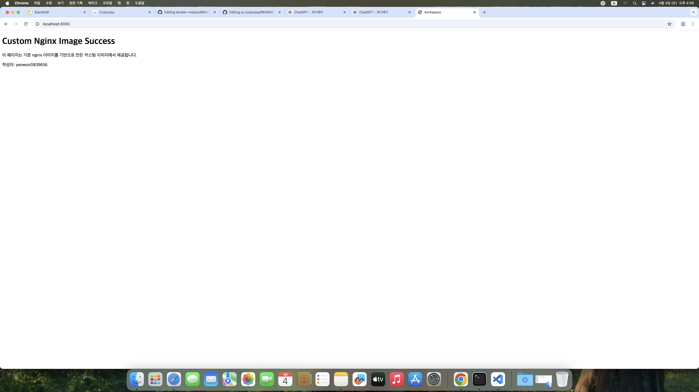
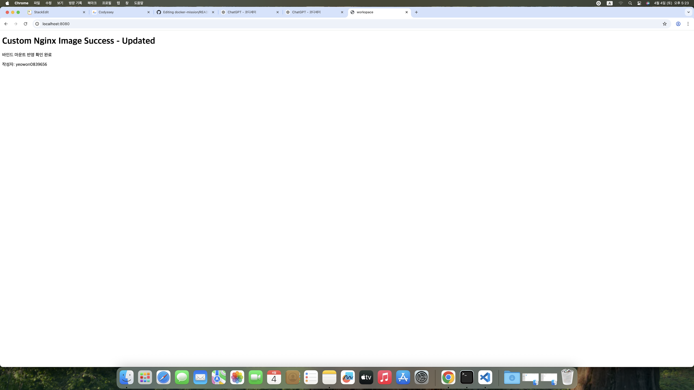
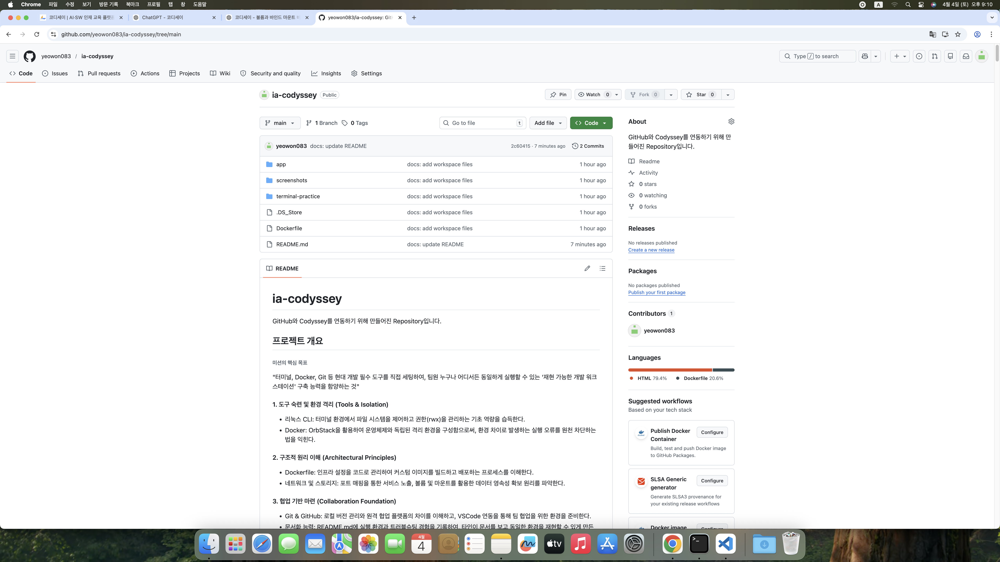

# ia-codyssey
GitHub와 Codyssey를 연동하기 위해 만들어진 Repository입니다.

## 프로젝트 개요
###### 미션의 핵심 목표
"터미널, Docker, Git 등 현대 개발 필수 도구를 직접 세팅하여, 팀원 누구나 어디서든 동일하게 실행할 수 있는 '재현 가능한 개발 워크스테이션' 구축 능력을 함양하는 것"
#### 1. 도구 숙련 및 환경 격리 (Tools & Isolation)
- 리눅스 CLI: 터미널 환경에서 파일 시스템을 제어하고 권한(rwx)을 관리하는 기초 역량을 습득한다.
- Docker: OrbStack을 활용하여 운영체제와 독립된 격리 환경을 구성함으로써, 환경 차이로 발생하는 실행 오류를 원천 차단하는 법을 익힌다.
#### 2. 구조적 원리 이해 (Architectural Principles)
- Dockerfile: 인프라 설정을 코드로 관리하여 커스텀 이미지를 빌드하고 배포하는 프로세스를 이해한다.
- 네트워크 및 스토리지: 포트 매핑을 통한 서비스 노출, 볼륨 및 마운트를 활용한 데이터 영속성 확보 원리를 파악한다.
#### 3. 협업 기반 마련 (Collaboration Foundation)
- Git & GitHub: 로컬 버전 관리와 원격 협업 플랫폼의 차이를 이해하고, VSCode 연동을 통해 팀 협업을 위한 환경을 준비한다.
- 문서화 능력: README.md에 실행 환경과 트러블슈팅 경험을 기록하여, 타인이 문서를 보고 동일한 환경을 재현할 수 있게 만든다.
#### 4. 확장성 있는 사고방식 (Scalability)
- 단순 실습을 넘어 "**왜 이런 설계가 필요한가**"를 설명할 수 있는 수준을 지향한다. 이는 향후 CI/CD 파이프라인이나 클라우드 운영으로 확장하기 위한 필수적 사고방식이다.

## 1) 실행 환경
- OS: macOS 15.7.4
- Shell: zsh
- Docker: Docker version 28.5.2, build ecc6942
- Git: git version 2.53.0

## 2) 수행 체크리스트
- [x] 1. 터미널 기본 조작 및 폴더 구성
- [x] 2. 권한 변경 실습
- [x] 3. Docker 설치/점검
- [x] 4. hello-world 실행
- [x] 5. Dockerfile 빌드/실행
- [x] 6. 포트 매핑 접속(2회)
- [x] 7. 바인드 마운트 반영
- [x] 8. 볼륨 영속성
- [x] 9. Git 설정 + VSCode GitHub 연동

## 3) 수행 로그

# 1. 터미널 기본 조작 및 폴더 구성
## 작업 폴더 만들기
### <mark>현재 위치 확인</mark>
```bash
pwd
```
결과 
```Bash
/Users/<username>
```
### <mark>Desktop 폴더로 이동</mark>
```Bash
cd /Users/<username>/Desktop
```

### <mark>작업 폴더 만들기</mark>
```Bash
mkdir workspace # make directory
cd workspace # change directory
pwd # print working directory
```
결과
```Bash
/Users/<username>/Desktop/workspace
```
---
### <mark>1) 현재 위치 확인</mark>
```Bash
pwd # print working directory
```
결과
```Bash
/Users/<username>/Desktop/workspace
```

### <mark>2) 목록 확인</mark>
```Bash
ls # list
```
현재 디렉터리에 있는 파일과 폴더 목록을 확인할 수 있다.

### <mark>3) 숨김 파일 포함 목록 확인</mark>
```Bash
ls -la
```
- `-l` : 자세한 정보 표시
- `-a` : 숨김 파일 포함 전체 표시

결과
```Bash
total 0
drwxr-xr-x  2 <username>  <username>   64  4  4 13:35 .
drwx------+ 5 <username>  <username>  160  4  4 13:35 ..
```

### <mark>4) 생성</mark>
```Bash
mkdir terminal-practice # terminal-practice 폴더 생성
cd terminal-practice # 생성한 폴더로 이동
mkdir folder1 # 하위 폴더 생성
mkdir folder2 # 하위 폴더 생성
touch empty.txt # 빈 파일 생성
echo hello > note.txt # 내용이 있는 파일 생성
ls -la
```
결과
```Bash
total 8
drwxr-xr-x  6 <username>  <username>  192  4  4 13:44 .
drwxr-xr-x  3 <username>  <username>   96  4  4 13:44 ..
-rw-r--r--  1 <username>  <username>    0  4  4 13:44 empty.txt
drwxr-xr-x  2 <username>  <username>   64  4  4 13:44 folder1
drwxr-xr-x  2 <username>  <username>   64  4  4 13:44 folder2
-rw-r--r--  1 <username>  <username>    6  4  4 13:44 note.txt
```

### <mark>5) 이동</mark>
###### <mark>상대 경로로 이동</mark>
```Bash
cd folder1
pwd
```
결과
```Bash
/Users/<username>/Desktop/workspace/terminal-practice/folder1
```

###### <mark>상위 폴더로 이동</mark>
```Bash
cd .. 
pwd
```
- `..`: 현재 디렉토리의 부모 디렉토리(상위 폴더)
결과
```Bash
/Users/<username>/Desktop/workspace/terminal-practice
```
###### <mark>절대 경로로 이동</mark>
```Bash
/Users/<username>/Desktop/workspace/terminal-practice
pwd
```
결과
```Bash
/Users/<username>/Desktop/workspace/terminal-practice
```

### <mark>6) 파일 내용 확인</mark>
```Bash
cat note.txt # concatenate(연결하다)
```
결과
```Bash
hello
```
cat 명령어는 텍스트 파일의 내용을 터미널에 출력한다.

### <mark>7) 복사</mark>
```Bash
cp note.txt note-copy.txt # copy
ls
```
결과
```Bash
empty.txt	folder1		folder2		note-copy.txt	note.txt
```
note.txt 파일을 note-copy.txt라는 이름으로 복사했다.

### <mark>8) 이동 / 이름 변경</mark>
###### <mark>이름 변경</mark>
```Bash
mv note-copy.txt renamed.txt # move
```
###### <mark>파일 이동</mark>
```Bash
mv renamed.txt folder2
```
###### <mark>결과 확인</mark>
```Bash
ls
ls folder2
```
결과
```Bash
empty.txt	folder1		folder2		note.txt
renamed.txt
```
mv 명령어는 파일 이름 변경과 파일 이동 둘 다 가능하다.

### <mark>9) 삭제</mark>
###### <mark>파일 삭제</mark>
```Bash
rm empty.txt # remove
rm note.txt
```
###### <mark>폴더 삭제</mark>
```Bash
rmdir folder1 # remove directory
```
- `rm`은 파일을 삭제한다.
- `rmdir`은 빈 폴더를 삭제한다.
- `rmdir folder1`은 빈 폴더일 때만 삭제 가능하다.

###### <mark>폴더 안에 내용이 있을 경우</mark>
```Bash
rm -r folder2 
```
`-r` : 하위 파일과 하위 폴더까지 함께 삭제 

# 2. 권한 변경 실습
### <mark>1) Docker 실행</mark>
### <mark>2) 우분투 이미지가 있는지 확인</mark>
```bash
docker images
```
결과
```Bash
REPOSITORY   TAG       IMAGE ID   CREATED   SIZE
```
`ubuntu`가 보이면 우분투 이미지가 이미 있는 상태이다.

### <mark>3) 우분투 이미지가 없다면 다운로드</mark>
###### <mark>우분투 이미지 내려받기</mark>
```Bash
docker pull ubuntu
```
결과
```Bash
Using default tag: latest
latest: Pulling from library/ubuntu
817807f3c64e: Pull complete 
Digest: sha256:186072bba1b2f436cbb91ef2567abca677337cfc786c86e107d25b7072feef0c
Status: Downloaded newer image for ubuntu:latest
docker.io/library/ubuntu:latest
```
###### <mark>완료되면 다시 확인</mark>
```Bash
docker images
```
결과
```
REPOSITORY   TAG       IMAGE ID       CREATED       SIZE
ubuntu       latest    f794f40ddfff   5 weeks ago   78.1MB
```
### <mark>4) 우분투 컨테이너 실행하면서 리눅스 셸 들어가기</mark>
```Bash
docker run -it --name ubuntu-permission-lab ubuntu bash
```
- `docker run` : 컨테이너 실행
- `-it` : 터미널에서 직접 상호작용
- `--name ubuntu-permission-lab` : 컨테이너 이름 지정
- `ubuntu` : 사용할 이미지
- `bash` : bash 셸 실행

###### <mark>성공하면 프롬프트가 변경됨</mark>
```Bash
root@a89ceb9074df:/# 
```
리눅스 셸 안에 들어온 것이다.

### <mark>5) 리눅스에 제대로 들어왔는지 확인</mark>
```Bash
pwd
```
결과
```Bash
/
```
---
```Bash
uname -a
```
현재 사용 중인 시스템(운영체제 및 하드웨어)의 상세 정보를 한 줄로 출력하는 명령어이다. 여기서 `-a`는 all의 약자이다.

결과
```Bash
Linux a89ceb9074df 6.17.8-orbstack-00308-g8f9c941121b1 #1 SMP PREEMPT Thu Nov 20 09:34:02 UTC 2025 x86_64 x86_64 x86_64 GNU/Linux
```
---
```Bash
ls
```

결과:
```Bash
bin   dev  home  lib64  mnt  proc  run   srv  tmp  var
boot  etc  lib   media  opt  root  sbin  sys  usr
```

### <mark>6) 권한 실습용 폴더로 이동해서 만들기</mark>
```Bash
mkdir permission-lab
cd permission-lab
touch testfile.txt
mkdir testdir
ls -l
```
결과
```Bash
total 0
drwxr-xr-x 1 root root 0 Apr  4 05:46 testdir
-rw-r--r-- 1 root root 0 Apr  4 05:46 testfile.txt
```

### <mark>7) 파일 권한 변경 실습</mark>
###### <mark>변경 전 확인</mark>
```Bash
ls -l testfile.txt
```
결과
```Bash
-rw-r--r-- 1 root root 0 Apr  4 05:46 testfile.txt
```
###### <mark>권한 변경</mark>
```Bash
chmod 600 testfile.txt # change mode
```
###### <mark>변경 후 확인</mark>
```Bash
ls -l testfile.txt
```
결과
```Bash
-rw------- 1 root root 0 Apr  4 05:46 testfile.txt
```
###### <mark>비교</mark>
- 변경 전: `-rw-r--r--`
- 변경 후: `-rw-------`

### <mark>8) 디렉토리 권한 변경 실습</mark>
###### <mark>변경 전 확인</mark>
```Bash
ls -ld testdir
```
결과:
```Bash
drwxr-xr-x 1 root root 0 Apr  4 05:46 testdir
```
###### <mark>권한 변경</mark>
```Bash
chmod 700 testdir
```
###### <mark>변경 후 확인</mark>
```Bash
ls -ld testdir
```
결과
```Bash
drwx------ 1 root root 0 Apr  4 05:46 testdir
```
###### <mark>비교</mark>
- 변경 전: `drwxr-xr-x`
- 변경 후: `drwx------`

### <mark>9) 컨테이너에서 나오는 법</mark>

```Bash
exit
```

# 3. Docker 설치/점검
## Docker 설치 및 기본 점검
### <mark>1) Docker 버전 확인</mark>
```bash
docker --version
```
결과
```Bash
Docker version 28.5.2, build ecc6942
```
Docker CLI가 정상적으로 설치되어 있는지와 현재 설치된 Docker 버전을 확인한다.

### <mark>2) Docker 데몬 동작 여부 확인</mark>

```Bash
docker info
```
결과
```Bash
Client:
 Version:    28.5.2
 Context:    orbstack
 Debug Mode: false
 ...

Server:
 Containers: 0
  Running: 0
  Paused: 0
  Stopped: 0
 Images: 0
 Server Version: 28.5.2
 Storage Driver: overlay2
 ...
```
`docker info`는 Docker 클라이언트 정보와 함께 **Server** 정보가 출력되면 Docker 데몬이 정상 동작 중이라는 뜻이다.

## Docker 기본 운영 명령 수행
### <mark>1) 이미지 다운로드</mark>
```bash
docker pull nginx
```
결과
```Bash
Using default tag: latest
latest: Pulling from library/nginx
ec781dee3f47: Pull complete 
bb3d0aa29654: Pull complete 
510ddf6557d6: Pull complete 
cde7a05ae428: Pull complete 
587e3d84dbb5: Pull complete 
3189680c601f: Pull complete 
5e815e07e569: Pull complete 
Digest: sha256:7150b3a39203cb5bee612ff4a9d18774f8c7caf6399d6e8985e97e28eb751c18
Status: Downloaded newer image for nginx:latest
docker.io/library/nginx:latest
```
Docker Hub에서 nginx 이미지를 다운로드한다. 이미 동일한 이미지가 있으면 Image is up to date로 표시될 수 있다.

### <mark>2) 이미지 목록 확인</mark>
```Bash
docker images
```
결과
```Bash
REPOSITORY   TAG       IMAGE ID       CREATED       SIZE
nginx        latest    0cf1d6af5ca7   10 days ago   161MB
ubuntu       latest    f794f40ddfff   5 weeks ago   78.1MB
```
현재 로컬 환경에 저장된 Docker 이미지 목록을 확인한다.

### <mark>3) 컨테이너 실행</mark>
```Bash
docker run -d --name my-nginx -p 8080:80 nginx
```
- `-d` : 백그라운드 실행
- `--name my-nginx` : 컨테이너 이름 지정
- `-p 8080:80` : Mac의 8080 포트를 컨테이너의 80 포트와 연결

결과
```Bash
b0e2fd7f0a0b814168a73210dd800f0c3349f6aca179f178e354a12998a24f8d
```
nginx 컨테이너를 백그라운드에서 실행하고, 브라우저에서 http://localhost:8080으로 접속할 수 있도록 포트를 연결한다.

### <mark>4) 실행 중인 컨테이너 목록 확인</mark>
```Bash
docker ps # process status
```
결과
```Bash
CONTAINER ID   IMAGE     COMMAND                   CREATED              STATUS              PORTS                                     NAMES
b0e2fd7f0a0b   nginx     "/docker-entrypoint.…"   About a minute ago   Up About a minute   0.0.0.0:8080->80/tcp, [::]:8080->80/tcp   my-nginx
```
현재 실행 중인 컨테이너만 확인한다. PORTS 항목에 8080->80이 보이면 포트 매핑이 정상 적용된 것이다.

### <mark>5) 전체 컨테이너 목록 확인</mark>
```Bash
docker ps -a
```
결과
```Bash
CONTAINER ID   IMAGE     COMMAND                   CREATED          STATUS                        PORTS                                     NAMES
b0e2fd7f0a0b   nginx     "/docker-entrypoint.…"   4 minutes ago    Up 4 minutes                  0.0.0.0:8080->80/tcp, [::]:8080->80/tcp   my-nginx
a89ceb9074df   ubuntu    "bash"                    37 minutes ago   Exited (127) 16 minutes ago                                             ubuntu-permission-lab
```
실행 중인 컨테이너뿐 아니라 종료된 컨테이너까지 포함해 전체 목록을 확인한다.

### <mark>6) 로그 확인</mark>
```Bash
docker logs my-nginx
```
결과
```Bash
/docker-entrypoint.sh: /docker-entrypoint.d/ is not empty, will attempt to perform configuration
/docker-entrypoint.sh: Looking for shell scripts in /docker-entrypoint.d/
/docker-entrypoint.sh: Launching /docker-entrypoint.d/10-listen-on-ipv6-by-default.sh
10-listen-on-ipv6-by-default.sh: info: Getting the checksum of /etc/nginx/conf.d/default.conf
10-listen-on-ipv6-by-default.sh: info: Enabled listen on IPv6 in /etc/nginx/conf.d/default.conf
/docker-entrypoint.sh: Sourcing /docker-entrypoint.d/15-local-resolvers.envsh
/docker-entrypoint.sh: Launching /docker-entrypoint.d/20-envsubst-on-templates.sh
/docker-entrypoint.sh: Launching /docker-entrypoint.d/30-tune-worker-processes.sh
/docker-entrypoint.sh: Configuration complete; ready for start up
2026/04/04 06:12:42 [notice] 1#1: using the "epoll" event method
2026/04/04 06:12:42 [notice] 1#1: nginx/1.29.7
2026/04/04 06:12:42 [notice] 1#1: built by gcc 14.2.0 (Debian 14.2.0-19) 
2026/04/04 06:12:42 [notice] 1#1: OS: Linux 6.17.8-orbstack-00308-g8f9c941121b1
2026/04/04 06:12:42 [notice] 1#1: getrlimit(RLIMIT_NOFILE): 20480:1048576
2026/04/04 06:12:42 [notice] 1#1: start worker processes
2026/04/04 06:12:42 [notice] 1#1: start worker process 28
2026/04/04 06:12:42 [notice] 1#1: start worker process 29
2026/04/04 06:12:42 [notice] 1#1: start worker process 30
2026/04/04 06:12:42 [notice] 1#1: start worker process 31
2026/04/04 06:12:42 [notice] 1#1: start worker process 32
2026/04/04 06:12:42 [notice] 1#1: start worker process 33
```
컨테이너 내부에서 실행 중인 애플리케이션의 로그를 확인한다.
nginx 관련 시작 로그가 출력되면 웹 서버가 정상적으로 구동된 것으로 볼 수 있다.

### <mark>7) 리소스 확인</mark>
```Bash
docker stats --no-stream
```
결과:
```Bash
CONTAINER ID   NAME       CPU %     MEM USAGE / LIMIT     MEM %     NET I/O         BLOCK I/O         PIDS
b0e2fd7f0a0b   my-nginx   0.00%     6.238MiB / 15.67GiB   0.04%     1.13kB / 126B   16.7MB / 8.19kB   7
```
실행 중인 컨테이너의 CPU, 메모리, 네트워크, 디스크 사용량을 한 번만 출력해 확인한다.

### <mark>8) 컨테이너 중지</mark>
```Bash
docker stop my-nginx
```
결과
```Bash
my-nginx
```

### <mark>9) 중지 후 전체 목록 다시 확인</mark>
```Bash
docker ps -a
```
결과:
```Bash
CONTAINER ID   IMAGE     COMMAND                   CREATED          STATUS                        PORTS     NAMES
b0e2fd7f0a0b   nginx     "/docker-entrypoint.…"   12 minutes ago   Exited (0) 47 seconds ago               my-nginx
a89ceb9074df   ubuntu    "bash"                    45 minutes ago   Exited (127) 25 minutes ago             ubuntu-permission-lab
```
컨테이너가 중지된 뒤 STATUS가 Exited로 표시되는지 확인한다.

# 4. hello-world 실행 
## 컨테이너 실행 실습
### <mark>1) `hello-world` 실행 성공 기록</mark>
```bash
docker run hello-world
```
결과:
```Bash
...
Hello from Docker!
This message shows that your installation appears to be working correctly.
...
```
- hello-world 컨테이너는 아주 짧은 테스트용 컨테이너다.
- 실행되면 안내 메시지를 출력한 뒤 바로 종료된다.
- Docker 엔진이 정상적으로 동작하는지 가장 간단하게 확인할 수 있다.

###### <mark>실행 후 상태 확인</mark>
```Bash
docker ps -a
```
결과:
```Bash
CONTAINER ID   IMAGE         COMMAND                   CREATED          STATUS                        PORTS     NAMES
3fa614743818   hello-world   "/hello"                  55 seconds ago   Exited (0) 54 seconds ago               upbeat_satoshi
b0e2fd7f0a0b   nginx         "/docker-entrypoint.…"   16 minutes ago   Exited (0) 4 minutes ago                my-nginx
a89ceb9074df   ubuntu        "bash"                    49 minutes ago   Exited (127) 29 minutes ago             ubuntu-permission-lab
```
hello-world 컨테이너가 Exited (0) 상태로 보이면 정상적으로 실행 후 종료된 것이다.

### <mark>2) `ubuntu` 컨테이너 실행 후 내부 진입</mark>
```Bash
docker run -it --name ubuntu-lab ubuntu bash
```
- `-i` : 표준 입력을 열어 둔다.
- `-t` : 터미널 형태로 연결한다.
- `--name ubuntu-lab` : 컨테이너 이름을 지정한다.
- `ubuntu` : 사용할 이미지이다.
- `bash` : 컨테이너 안에서 bash 셸을 실행한다.

결과
```Bash
root@8418dfee4b5d:/# 
```
Ubuntu 컨테이너 내부 셸에 들어온 상태이다.

### <mark>3) 컨테이너 내부에서 간단 명령 수행</ma>
```Bash
ls
```
결과
```Bash
bin   dev  home  lib64  mnt  proc  run   srv  tmp  var
boot  etc  lib   media  opt  root  sbin  sys  usr
```
---
```Bash
echo hello ubuntu
```
결과
```Bash
hello ubuntu
```
---
명령어
```Bash
pwd
```
결과
```Bash
/
```
- `ls` : 현재 디렉터리의 파일 및 폴더 목록을 확인한다.
- `echo hello ubuntu` : 문자열을 출력한다.
- `pwd` : 현재 작업 중인 디렉터리 위치를 확인한다.

### <mark>4) 컨테이너 종료</mark>
```Bash
exit
```
- 현재 bash 셸을 종료한다.
- 메인 프로세스가 종료되므로 컨테이너도 함께 종료된다.
- 이후 macOS 터미널로 돌아오게 된다.

###### <mark>종료 후 확인</mark>
```Bash
docker ps -a
```
결과
```Bash
CONTAINER ID   IMAGE         COMMAND                   CREATED          STATUS                        PORTS     NAMES
8418dfee4b5d   ubuntu        "bash"                    6 minutes ago    Exited (0) 7 seconds ago                ubuntu-lab
3fa614743818   hello-world   "/hello"                  9 minutes ago    Exited (0) 9 minutes ago                upbeat_satoshi
b0e2fd7f0a0b   nginx         "/docker-entrypoint.…"   24 minutes ago   Exited (0) 13 minutes ago               my-nginx
a89ceb9074df   ubuntu        "bash"                    58 minutes ago   Exited (127) 37 minutes ago             ubuntu-permission-lab
```
ubuntu-lab이 Exited 상태로 보이면 정상이다.

### <mark>5) 종료된 ubuntu 컨테이너 다시 시작</mark>
```Bash
docker start ubuntu-lab
```
결과
```Bash
ubuntu-lab
```
###### <mark>그 다음 상태 확인</mark>
```Bash
docker ps -a
```
결과
```Bash
CONTAINER ID   IMAGE         COMMAND                   CREATED             STATUS                        PORTS     NAMES
8418dfee4b5d   ubuntu        "bash"                    8 minutes ago       Up 48 seconds                           ubuntu-lab
3fa614743818   hello-world   "/hello"                  11 minutes ago      Exited (0) 11 minutes ago               upbeat_satoshi
b0e2fd7f0a0b   nginx         "/docker-entrypoint.…"   27 minutes ago      Exited (0) 15 minutes ago               my-nginx
a89ceb9074df   ubuntu        "bash"                    About an hour ago   Exited (127) 39 minutes ago             ubuntu-permission-lab
```
- docker start는 종료된 컨테이너를 다시 시작하는 명령이다.
- 컨테이너의 메인 프로세스가 다시 살아나면 Up 상태로 표시된다.
- 다만 컨테이너 종류에 따라 메인 프로세스가 바로 끝나면 다시 Exited 상태가 될 수도 있다.

### 6) 실행 중인 컨테이너에 `exec`로 새 셸 진입
###### <mark>오래 유지되는 컨테이너를 하나 실행<mark>
```Bash
docker run -dit --name ubuntu-keep ubuntu bash
```
결과
```Bash
d28b04c92eee454750e16c440d02c6367782b059213ecf01f3e58871b91d7618
```
###### <mark>상태 확인</mark>
```Bash
docker ps
```
결과
```Bash
CONTAINER ID   IMAGE     COMMAND   CREATED          STATUS          PORTS     NAMES
d28b04c92eee   ubuntu    "bash"    4 minutes ago    Up 4 minutes              ubuntu-keep
8418dfee4b5d   ubuntu    "bash"    18 minutes ago   Up 10 minutes             ubuntu-lab
```

###### <mark>이제 `exec`로 들어가기</mark>
```Bash
docker exec -it ubuntu-keep bash
```
###### <mark>컨테이너 안에서 테스트</mark>
```Bash
echo inside exec
```
결과
```Bash
inside exec
```
---
```Bash
ls
```
결과
```Bash
bin   dev  home  lib64  mnt  proc  run   srv  tmp  var
boot  etc  lib   media  opt  root  sbin  sys  usr
```
###### <mark>끝내기</mark>
```Bash
exit
```
- docker exec -it는 이미 실행 중인 컨테이너 안에 새 프로세스(bash)를 추가로 실행하는 방식이다.
- 따라서 exit로 빠져나와도 원래 컨테이너는 계속 실행될 수 있다.

###### <mark>다시 확인</mark>
```Bash
docker ps
```
결과
```cmd
CONTAINER ID   IMAGE     COMMAND   CREATED          STATUS          PORTS     NAMES
d28b04c92eee   ubuntu    "bash"    14 minutes ago   Up 13 minutes             ubuntu-keep
8418dfee4b5d   ubuntu    "bash"    28 minutes ago   Up 20 minutes             ubuntu-lab

```
`ubuntu-keep`이 여전히 `Up` 상태면 된다.

### <mark>7) `attach` 관찰</mark>
```Bash
docker attach ubuntu-keep
```
- `attach`는 컨테이너의 기존 메인 프로세스에 직접 연결하는 방식이다.
- `attach` : 원래 돌아가던 프로세스에 붙음
- `exec` : 새 셸을 하나 더 열어 들어감

###### <mark>실습 후 컨테이너 상태 확인</mark>
```Bash
docker ps -a
```
결과
```Bash
CONTAINER ID   IMAGE         COMMAND                   CREATED             STATUS                           PORTS     NAMES
d28b04c92eee   ubuntu        "bash"                    27 minutes ago      Exited (127) 4 seconds ago                 ubuntu-keep
8418dfee4b5d   ubuntu        "bash"                    41 minutes ago      Up 34 minutes                              ubuntu-lab
3fa614743818   hello-world   "/hello"                  45 minutes ago      Exited (0) 45 minutes ago                  upbeat_satoshi
b0e2fd7f0a0b   nginx         "/docker-entrypoint.…"   About an hour ago   Exited (0) 48 minutes ago                  my-nginx
a89ceb9074df   ubuntu        "bash"                    2 hours ago         Exited (127) About an hour ago             ubuntu-permission-lab
```
- `docker attach`는 기존 메인 프로세스에 직접 연결하는 방식이며, 이번 실습에서는 연결 후 빠져나오는 과정에서 메인 프로세스가 종료되어 컨테이너도 함께 종료되었다.
- 따라서 운영 중인 컨테이너 내부에 안전하게 들어가 작업할 때는 일반적으로 `attach`보다 `exec`가 더 유용하다.

# 5. Dockerfile 빌드/실행 
###### <mark>디렉터리 구조</mark>
### <mark>1) 작업 폴더로 이동</mark>
###### <mark>작업 폴더 생성</mark>
```Bash
mkdir app
```
###### <mark>이동</mark>
```Bash
cd /Users/<username>/Desktop/workspace/app
```
###### <mark>현재 위치 확인</mark>
```Bash
pwd
ls -la
```
결과
```Bash
/Users/<username>/Desktop/workspace/app
total 0
drwxr-xr-x  2 <username>  <username>   64  4  4 16:23 .
drwxr-xr-x  6 <username>  <username>  192  4  4 16:23 ..
```
### 2) <mark>`index.html` 만들기</mark>
###### <mark>파일 이름</mark>
```
index.html
```
###### <mark>내용</mark>
```HTML
<!DOCTYPE html>
<html lang="ko">
<head>
  <meta charset="UTF-8">
  <title>workspace</title>
</head>
<body>
  <h1>Custom Nginx Image Success</h1>
  <p>이 페이지는 기존 nginx 이미지를 기반으로 만든 커스텀 이미지에서 제공됩니다.</p>
  <p>작성자: "username"</p>
</body>
</html>
```
### <mark>3) `Dockerfile` 만들기</mark>
###### <mark>파일 이름</mark>
```
Dockerfile
```
###### <mark>내용</mark>
```dockerfile
FROM nginx:latest
COPY index.html /usr/share/nginx/html/index.html
```
### <mark>4) Dockerfile이 의미하는 것</mark>
- `FROM nginx:latest`
    - 기존 베이스 이미지로 `nginx`를 사용한다는 뜻
- `COPY index.html /usr/share/nginx/html/index.html`
    - 내가 만든 HTML 파일로 nginx 기본 웹페이지를 교체한다는 뜻

즉, **기존 nginx 이미지를 바탕으로 정적 콘텐츠만 바꾼 커스텀 이미지**

### <mark>5) 이미지 빌드</mark>
###### <mark>`Dockerfile` 있는 폴더에서 실행</mark>
```Bash
docker build -t my-custom-nginx . # tag
```
- `-t my-custom-nginx` : 이미지 이름 지정
- `.` : 현재 폴더를 빌드 컨텍스트로 사용

결과
```Bash
[+] Building 1.7s (7/7) FINISHED                                docker:orbstack
 => [internal] load build definition from Dockerfile                       0.1s
 => => transferring dockerfile: 103B                                       0.0s
 => [internal] load metadata for docker.io/library/nginx:latest            0.0s
 => [internal] load .dockerignore                                          0.2s
 => => transferring context: 2B                                            0.0s
 => [internal] load build context                                          0.4s
 => => transferring context: 348B                                          0.0s
 => [1/2] FROM docker.io/library/nginx:latest                              0.8s
 => [2/2] COPY index.html /usr/share/nginx/html/index.html                 0.1s
 => exporting to image                                                     0.2s
 => => exporting layers                                                    0.1s
 => => writing image sha256:1eb8d7fa6ae8176358842bd9b038cd543d24bcd8f39ab  0.0s
 => => naming to docker.io/library/my-custom-nginx                         0.0s
```
### <mark>6) 이미지 목록 확인</mark>
```Bash
docker images
```
결과
```Bash
REPOSITORY        TAG       IMAGE ID       CREATED          SIZE
my-custom-nginx   latest    1eb8d7fa6ae8   49 seconds ago   161MB
nginx             latest    0cf1d6af5ca7   10 days ago      161MB
hello-world       latest    e2ac70e7319a   11 days ago      10.1kB
ubuntu            latest    f794f40ddfff   5 weeks ago      78.1MB
```
여기서 `my-custom-nginx`가 보이면 빌드 성공

### <mark>7) 컨테이너 실행</mark>
```Bash
docker run -d --name custom-nginx-container -p 8080:80 my-custom-nginx
```
- `-d` : 백그라운드 실행
- `--name custom-nginx-container` : 컨테이너 이름 지정
- `-p 8080:80` : 내 PC의 8080 포트를 컨테이너 80 포트와 연결

결과
```Bash
8d9649217afbd13a1b53916acc262a7032f65a7402062b1f31507ab2942f642c
```

### <mark>8) 실행 확인</mark>
###### <mark>컨테이너 상태 확인</mark>
```Bash
docker ps
```
결과
```Bash
CONTAINER ID   IMAGE             COMMAND                   CREATED             STATUS             PORTS                                     NAMES
8d9649217afb   my-custom-nginx   "/docker-entrypoint.…"   56 seconds ago      Up 56 seconds      0.0.0.0:8080->80/tcp, [::]:8080->80/tcp   custom-nginx-container
8418dfee4b5d   ubuntu            "bash"                    About an hour ago   Up About an hour                                             ubuntu-lab
```
`custom-nginx-container`가 `Up` 상태면 성공

###### <mark>브라우저 확인(1차 접속)</mark>
브라우저 주소창에:
```
http://localhost:8080
```
입력하여 커스텀 페이지가 정상적으로 표시되는 것을 확인

### 9) 로그 확인도 가능
```Bash
docker logs custom-nginx-container
```
결과
```Bash
/docker-entrypoint.sh: /docker-entrypoint.d/ is not empty, will attempt to perform configuration
/docker-entrypoint.sh: Looking for shell scripts in /docker-entrypoint.d/
/docker-entrypoint.sh: Launching /docker-entrypoint.d/10-listen-on-ipv6-by-default.sh
10-listen-on-ipv6-by-default.sh: info: Getting the checksum of /etc/nginx/conf.d/default.conf
10-listen-on-ipv6-by-default.sh: info: Enabled listen on IPv6 in /etc/nginx/conf.d/default.conf
/docker-entrypoint.sh: Sourcing /docker-entrypoint.d/15-local-resolvers.envsh
/docker-entrypoint.sh: Launching /docker-entrypoint.d/20-envsubst-on-templates.sh
/docker-entrypoint.sh: Launching /docker-entrypoint.d/30-tune-worker-processes.sh
/docker-entrypoint.sh: Configuration complete; ready for start up
2026/04/04 07:49:52 [notice] 1#1: using the "epoll" event method
2026/04/04 07:49:52 [notice] 1#1: nginx/1.29.7
2026/04/04 07:49:52 [notice] 1#1: built by gcc 14.2.0 (Debian 14.2.0-19) 
2026/04/04 07:49:52 [notice] 1#1: OS: Linux 6.17.8-orbstack-00308-g8f9c941121b1
2026/04/04 07:49:52 [notice] 1#1: getrlimit(RLIMIT_NOFILE): 20480:1048576
2026/04/04 07:49:52 [notice] 1#1: start worker processes
2026/04/04 07:49:52 [notice] 1#1: start worker process 29
2026/04/04 07:49:52 [notice] 1#1: start worker process 30
2026/04/04 07:49:52 [notice] 1#1: start worker process 31
2026/04/04 07:49:52 [notice] 1#1: start worker process 32
2026/04/04 07:49:52 [notice] 1#1: start worker process 33
2026/04/04 07:49:52 [notice] 1#1: start worker process 34
```

###### 어떤 기존 베이스를 선택했는지
- `nginx:latest`를 베이스 이미지로 선택
- A안: 웹 서버 베이스 이미지 활용 + 정적 콘텐츠 교체

# 6. 포트 매핑 접속(2회)

1차 접속 화면:



# 7. 바인드 마운트 반영 및 2차 접속 확인
###### <mark>기존 컨테이너 삭제</mark>
```Bash
docker rm -f custom-nginx-container
``` 

###### <mark>바인드 마운트로 다시 실행</mark>
```Bash
docker run -d --name custom-nginx-container -p 8080:80 -v "$(pwd)/index.html:/usr/share/nginx/html/index.html" my-custom-nginx
```
- `-v "$(pwd)/index.html:/usr/share/nginx/html/index.html"`  
    → 호스트의 `index.html` 파일을 컨테이너 내부 NGINX 기본 페이지 경로에 바인드 마운트
- 호스트의 `index.html` 내용을 수정한 뒤 브라우저를 새로고침하여 변경 사항이 즉시 반영되는지 확인했다.

###### <mark>수정</mark>
```HTML
<h1>Custom Nginx Image Success - Updated</h1>
<p>바인드 마운트 반영 확인 완료</p>
<p>작성자: "username"</p>
```

###### <mark>2차 접속 확인</mark>
브라우저에서:
```
http://localhost:8080
```
를 다시 열거나 새로고침하여 수정된 내용이 반영된 것을 확인

2차 접속 화면(바인드 마운트 반영 후):



# 8. 볼륨 영속성
### <mark>1) Docker 볼륨 생성</mark>
```Bash
docker volume create my-data-volume
```
결과
```Bash
my-data-volume
```

###### <mark>볼륨 목록 확인</mark>
```Bash
docker volume ls
```
결과
```Bash
DRIVER    VOLUME NAME
local     my-data-volume
```
### <mark>2) 볼륨을 연결한 컨테이너 실행</mark>
```Bash
docker run -it --name volume-test-1 -v my-data-volume:/data ubuntu bash
```
- `-v my-data-volume:/data`
	- Docker 볼륨 `my-data-volume`을 컨테이너 내부 `/data` 폴더에 연결

###### <mark>성공하면 리눅스 셸로 들어감</mark>
```Bash
root@4dcd68fa13f8:/# 
```

### <mark>3) 컨테이너 안에서 데이터 생성</mark>
###### <mark>컨테이너 내부</mark>
```Bash
echo hello volume > /data/message.txt
cat /data/message.txt
ls /data
```
결과
```Bash
hello volume
message.txt
```
- `/data/message.txt` 파일을 만들고
- 그 안에 `hello volume` 저장
- 실제로 파일이 있는지 확인

### <mark>4) 컨테이너 종료 후 삭제</mark>
###### <mark>컨테이너 내부에서 먼저 종료</mark>
```Bash
exit
```

###### <mark>다시 터미널에서 컨테이너 삭제</mark>
```Bash
docker rm volume-test-1
```
결과
```Bash
volume-test-1
```
###### <mark>중요</mark>
- 지금 삭제한 건 **컨테이너**
- **볼륨 `my-data-volume`은 삭제하지 않음**

### <mark>5) 같은 볼륨을 연결한 새 컨테이너 실행</mark>
```Bash
docker run -it --name volume-test-2 -v my-data-volume:/data ubuntu bash
```
### <mark>6) 삭제 전 데이터가 유지되는지 확인</mark>
###### <mark>컨테이너 내부에서</mark>
```Bash
cat /data/message.txt
ls /data
```
결과
```Bash
hello volume
message.txt
```
= **영속성 증거**

- 첫 번째 컨테이너에서 만든 파일이
- 첫 번째 컨테이너를 삭제한 뒤에도
- 같은 볼륨을 연결한 두 번째 컨테이너에서 그대로 보임

### <mark>7) 필요하면 마지막 종료</mark>
```Bash
exit
```

# 9. Git 설정 + VSCode GitHub 연동
### <mark>1) Git 사용자 정보 설정</mark>
``` Bash
git config --global user.name <username>
git config --global user.email yeo******@gmail.com
```
- `user.name` : 커밋 작성자 이름
- `user.email` : 커밋 작성자 이메일

### <mark>2) 기본 브랜치 설정</mark>
###### <mark>기본 브랜치를 `main`으로 설정</mark>
```Bash
git config --global init.defaultBranch main
```
새 저장소를 `git init` 했을 때 기본 브랜치 이름이 `main`이 되도록 설정한다.

### <mark>3) 설정 확인</mark>
```Bash
git config --list
```
결과
```Bash
credential.helper=osxkeychain
user.name=<username>
user.email=yeo******@gmail.com
init.defaultbranch=main
```

### <mark>4) 프로젝트 폴더에서 Git 저장소 초기화</mark>
###### <mark>프로젝트 폴더로 이동</mark>
```Bash
cd ~/Desktop/workspace
```

###### <mark>그 다음</mark>
```Bash
git init
```
결과
```Bash
/Users/<username>/Desktop/workspace/.git/ 안의 빈 깃 저장소를 다시 초기화했습니다
```
### <mark>5) GitHub에서 저장소 만들기</mark>
###### <mark>GitHub 사이트에서 새 저장소를 만들기</mark>
저장소 이름
```
ia-codyssey
```
주소
```
https://github.com/<username>/ia-codyssey.git
```
### <mark>6) 로컬 저장소와 GitHub 원격 저장소 연결</mark>
```Bash
git remote add origin https://github.com/<username>/ia-codyssey.git
git remote -v
```
결과
```Bash
origin	https://github.com/<username>/ia-codyssey.git (fetch)
origin	https://github.com/<username>/ia-codyssey.git (push)
```
**GitHub 연동 증거**로 아주 중요

### <mark>7) 파일 추가 후 첫 커밋</mark>
```Bash
git add .
git commit -m "docs: add workspace files"
```
결과
```Bash
 9 files changed, 1193 insertions(+)
 create mode 100644 .DS_Store
 create mode 100644 Dockerfile
 create mode 100644 README.md
 create mode 100644 app/index.html
 create mode 100644 screenshots/.DS_Store
 create mode 100644 screenshots/custom-nginx-browser-1.png
 create mode 100644 screenshots/custom-nginx-browser-2.png
 create mode 100644 terminal-practice/.DS_Store
 create mode 100644 terminal-practice/folder2/renamed.txt
```

### <mark>8) 원격 저장소에 푸시</mark>
```Bash
git branch -M main  
git push -u origin main
```
결과
```Bash
Username for 'https://github.com': 
Password for 'https://<username>@github.com': 
```
username, password 입력

###### <mark>트러블슈팅1</mark>
```
remote: Invalid username or token. Password authentication is not supported for Git operations.
fatal: Authentication failed for 'https://github.com/<username>/ia-codyssey.git/'
```
1. 문제: 타당하지 않은 사용자이름 또는 토큰

2. 원인가설: 비밀번호를 입력하는 것이 아닌 토큰을 입력해야 할 것

3. 확인: GitHub 비밀번호로 push/pull 하려고 해서 실패

4. 해결/대안: Personal Access Token(PAT) 사용
    1) GitHub 사이트에서
    2) 프로필 사진
    3) Settings
    4) Developer settings
    5) Personal access tokens
    6) Tokens (classic) 또는 Fine-grained token
    7) 새 토큰 생성

###### <mark>다시 push하기</mark>
```Bash  
git push -u origin main
```
결과
```Bash
Everything up-to-date
```
###### <mark>트러블슈팅2</mark>
1. 문제: VS Code 내용과 깃허브에 올라간 내용이 다름

2. 원인가설: 

3. 확인: 수정은 했지만 아직 Git 기록으로 저장(commit) 하지 않았기 때문 

4. 해결/대안: 
```Bash
git add README.md
git commit -m "docs: update README"
```
결과
```Bash
[main 2c60415] docs: update README
 1 file changed, 65 insertions(+), 85 deletions(-)
```
---
```Bash
git push origin main
```
결과
```Bash
오브젝트 나열하는 중: 5, 완료.
오브젝트 개수 세는 중: 100% (5/5), 완료.
Delta compression using up to 6 threads
오브젝트 압축하는 중: 100% (3/3), 완료.
오브젝트 쓰는 중: 100% (3/3), 1.14 KiB | 1.14 MiB/s, 완료.
Total 3 (delta 2), reused 0 (delta 0), pack-reused 0 (from 0)
remote: Resolving deltas: 100% (2/2), completed with 2 local objects.
To https://github.com/<username>/ia-codyssey.git
   f7c016c..2c60415  main -> main
```

### <mark>9) GitHub 연동 증거</mark>
GitHub 저장소와 로컬 저장소 연동 후, 프로젝트 파일이 원격 저장소에 정상적으로 업로드된 것을 확인했다.



### <mark>10) VS Code에서 저장소 열기</mark>
###### <mark>프로젝트 폴더가 있는지 확인</mark>
```Bash
cd ~/Desktop/workspace
pwd
ls -la
```
결과
```Bash
/Users/<username>/Desktop/workspace
total 104
drwxr-xr-x   9 <username>  <username>    288  4  4 21:10 .
drwx------+  5 <username>  <username>    160  4  4 21:10 ..
-rw-r--r--@  1 <username>  <username>   8196  4  4 21:10 .DS_Store
drwxr-xr-x  15 <username>  <username>    480  4  4 21:14 .git
drwxr-xr-x   3 <username>  <username>     96  4  4 20:06 app
-rw-r--r--   1 <username>  <username>     66  4  4 16:45 Dockerfile
-rw-r--r--@  1 <username>  <username>  36015  4  4 20:53 README.md
drwxr-xr-x   6 <username>  <username>    192  4  4 21:10 screenshots
drwxr-xr-x   4 <username>  <username>    128  4  4 14:01 terminal-practice
```
###### <mark>VS Code에서 Git 연동 확인</mark>
```Bash
code ~/Desktop/workspace
``` 
Git 관련 화면이 뜨는지 확인


